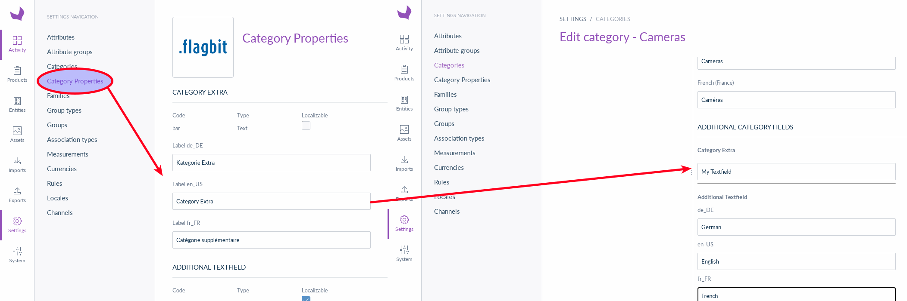

## Category Bundle

The Flagbit Akeneo Category Bundle allows you to add new category properties like text-fields, checkboxes, date-fields and
many more to enhance your categories with the data your shop needs. You can also localize the each category property for your
supported languages.

### A short list of features

* Export
* Import
* Multiple property types like text, checkbox, date
* Can be extended with your own property types

[](category-bundle.png)

### Installation

Install the package with Composer and the following command:

``` bash
composer require flagbit/category_bundle
```

#### Enable the bundle

Enable the bundle in the kernel:

``` php
<?php
// config/bundles.php

return [
    // ...
    Flagbit\Bundle\CategoryBundle\FlagbitCategoryBundle::class => ['all' => true],
];
```

#### Import the routing

``` yml
# config/routes/flagbit_category.yml
flagbit_category:
    resource: "@FlagbitCategoryBundle/Resources/config/routing.yml"
```

#### Create the needed database tables

``` bash
bin/console doctrine:schema:update
```

Clear the cache and you're ready to go.
